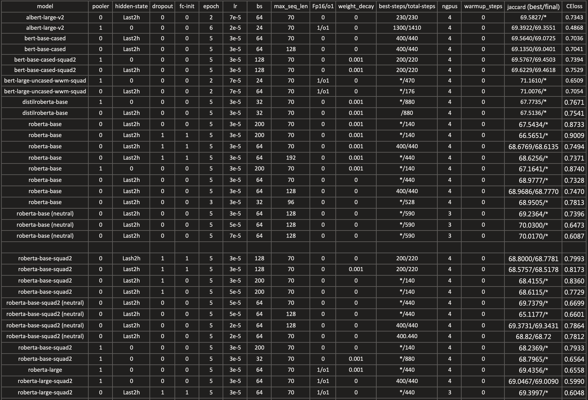

2020.08.26 —— 2020.08.28
1. allen 文件夹是尝试使用 AllenNLP 框架的代码，但是后面发现其文档还未更新完全，所以先放弃了这一版 😅
2. 目前主要使用 huggingface 文件夹中的代码，在这个基础上进行改进
- 目前 jaccard 得分为 0.69254

2020.08.31 —— 2020.09.05

* 表中 \* 表示一致
* last2h 表示使用最后两层隐藏状态

实验小结：  
1. 小的 batch size 会有更好的表现，64 或者 128
2. task layer 添加 dropout 和 特殊初始化没什么作用
3. 对于 sentiment 为 neutral 的样本直接使用原文作为答案可以提升效果
4. 模型上 bert-wwm 类最佳，其次 bert，roberta 表现最差，很奇怪，和讨论区的观点不太一致。
另外，经过 squad 数据 fine-tune 的模型并没有预想的表现的比未经过 fine-tune 的好